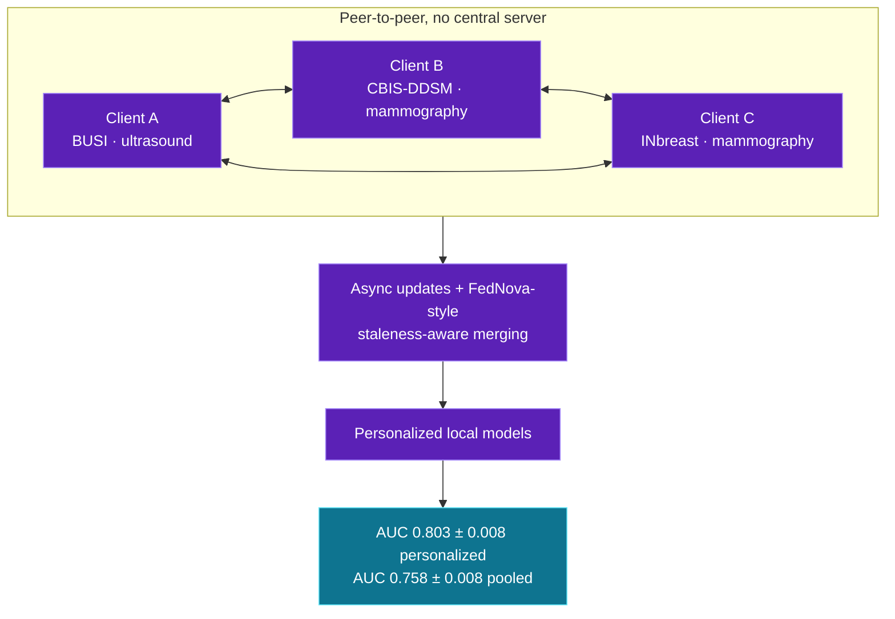
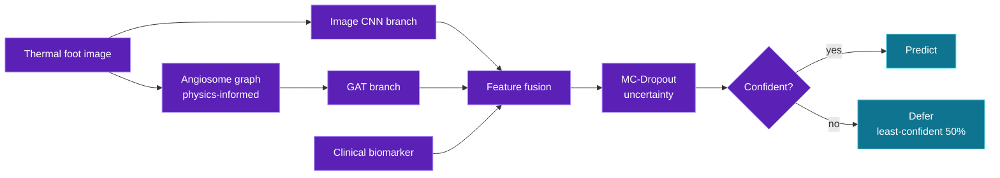
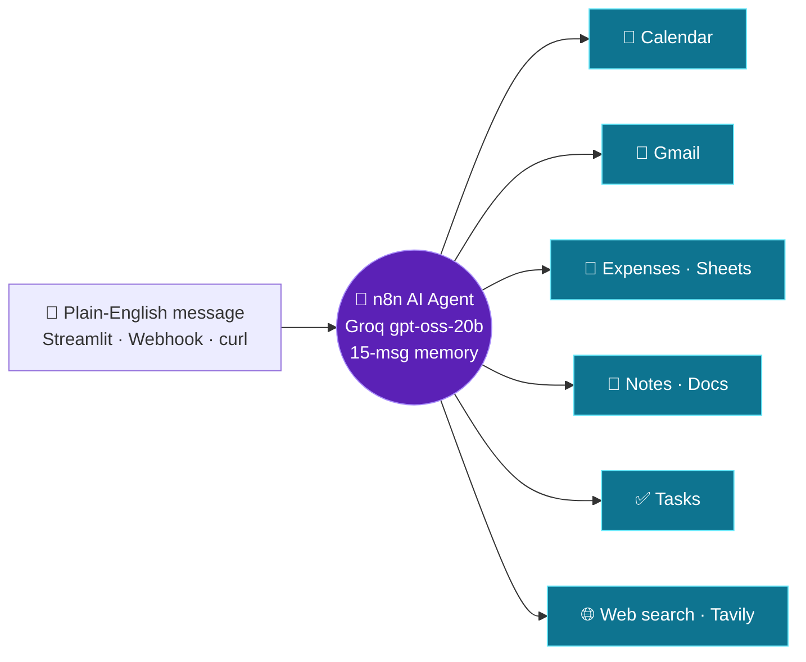
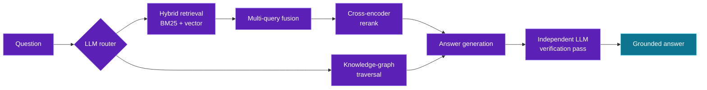

<!--
  Profile README for github.com/Harjotsingh0311
  TODO: a few project links below point to the repositories tab because I did not know the exact repo URLs.
  Search this file for "TODO-LINK" and swap in the direct repo links.
-->

<div align="center">


<a href="https://github.com/Harjotsingh0311">
  
</a>

<p>
  
  <a href="https://www.linkedin.com/in/harjot-singh-0311h/"></a>
  <a href="mailto:hsingh17_be24@thapar.edu"></a>
  <a href="https://github.com/Harjotsingh0311?tab=followers"></a>
</p>

**I build trustworthy medical AI, and the agents, RAG systems and edge pipelines around it.**

<sub>B.Tech AIML &nbsp;·&nbsp; Thapar Institute of Engineering &amp; Technology, Patiala &nbsp;·&nbsp; 2024 – 2028</sub>

<br/>

<a href="#-results-at-a-glance">Results</a> &nbsp;·&nbsp;
<a href="#-research">Research</a> &nbsp;·&nbsp;
<a href="#-applied-ai">Applied AI</a> &nbsp;·&nbsp;
<a href="#-vision-and-edge">Vision &amp; Edge</a> &nbsp;·&nbsp;
<a href="#-tech-stack">Stack</a> &nbsp;·&nbsp;
<a href="#-journey">Journey</a> &nbsp;·&nbsp;
<a href="#-quest-log">Quest Log</a>

</div>

<br/>

## 🪪 `model_card.yaml`

```yaml
model: harjot-singh-v2026
base: B.Tech AIML @ Thapar Institute (2024-2028)
location: Patiala, Punjab 🇮🇳

heads:
  research:    [medical imaging, federated learning, computer vision, uncertainty quantification]
  engineering: [RAG, agentic AI, n8n automation, edge deployment]

fine_tuned_on:
  - 3 multi-country hospital imaging datasets
  - 4 merged Indian traffic datasets
  - 416M+ e-challan records (and lived to tell the tale)

eval_protocol: "patient-level splits, always. Leakage is the enemy."

known_limitations:
  - "gets suspiciously excited about ablation studies"
  - "will reproduce your benchmark before citing it"

intended_use: [research collaboration, AI/ML internships, hackathon teams]
```

<br/>

## 📊 Results at a glance

<table>
  <tr>
    <td align="center" width="25%"><h2>5 / 5</h2><sub>seeds beating a published<br/>oncology FL benchmark</sub></td>
    <td align="center" width="25%"><h2>0.882</h2><sub>ThermoGAT ROC-AUC<br/>patient-level 5-fold CV</sub></td>
    <td align="center" width="25%"><h2>2 ms</h2><sub>CitrusNet inference<br/>416K parameters</sub></td>
    <td align="center" width="25%"><h2>96.4%</h2><sub>priority-vehicle AP<br/>at 95% recall</sub></td>
  </tr>
  <tr>
    <td align="center"><h2>48</h2><sub>FL configs benchmarked<br/>8 backbones × 6 aggregators</sub></td>
    <td align="center"><h2>81% → 94%</h2><sub>accuracy by deferring the<br/>least-confident 50% (MC-Dropout)</sub></td>
    <td align="center"><h2>83.4%</h2><sub>mAP@0.5 with YOLO11s<br/>15% smaller than YOLOv8s</sub></td>
    <td align="center"><h2>20+</h2><sub>ablation and robustness<br/>experiments on ThermoGAT</sub></td>
  </tr>
</table>

<br/>

## 🔬 Research

> [!NOTE]
> The thread through all of it: **evaluate honestly.** Patient-level splits, leakage-safe pipelines, uncertainty estimates and ablations that explain *why* something works.

### 🩺 Personalized Async Peer-to-Peer Federated Learning for Medical Diagnosis


Hospitals cannot share patient images, so the model has to travel instead of the data. I engineered a **personalized, asynchronous peer-to-peer FL architecture** with FedNova-style staleness-aware merging. It surpasses the Panda, Patro, Das &amp; Kar (2026) ASIDE oncology FL benchmark on personalized (**AUC 0.803 ± 0.008**) and pooled (**AUC 0.758 ± 0.008**) metrics in **5 out of 5 seeds**, closing all 3 gaps its authors flagged.

- 🏥 **Data:** 3 multi-country hospital datasets (BUSI, CBIS-DDSM, INbreast), 3,900+ DICOM ultrasound and mammography images
- 🧪 **Benchmark:** 8 CNN/ViT backbones × 6 aggregation strategies (FedAvg, FedProx, FedNova, SCAFFOLD, FedBN, P2P) = 48 configurations
- 🐛 **Debugging:** fixed a global-model collapse and 5 reproducibility bugs in the PyTorch/Flower pipeline

<details>
<summary><b>▶ See the architecture</b></summary>



</details>

<br/>

### 🦶 ThermoGAT: Physics-Informed Graph Attention Network for Diabetic-Foot Screening


Earlier diabetic-foot work evaluated at the *image* level, so images from the same patient leaked across train and test. ThermoGAT fixes that with **patient-level splits on 167 subjects** and a dual-branch design: an angiosome graph (the physiology of foot blood supply) plus a thermal-image CNN.

- 📈 **ROC-AUC 0.882 ± 0.056** under patient-level 5-fold cross-validation
- 🧬 Fused with the clinical biomarker, it **significantly beats the biomarker alone** (DeLong *p* = 0.019)
- 🎯 **MC-Dropout uncertainty** lets it defer the least-confident 50% of cases, lifting accuracy from 81% to 94% (post-hoc)

<details>
<summary><b>▶ See the architecture</b></summary>



</details>

<br/>

### 🍊 CitrusNet: Lightweight CNN for Citrus Leaf Disease


A **416K-parameter** depthwise-separable and dilated CNN that reaches **96.67% test accuracy** (0.966 macro-F1) on 4-class citrus leaf classification at **2 ms latency**. It beats a fine-tuned EfficientNet-B0 and matches ResNet50 and DenseNet121 accuracy at **4–10× faster inference**, with Grad-CAM to confirm it looks at the leaf, not the background.

- 🧼 **Leakage-safe pipeline:** perceptual-hash de-duplication plus group-aware splits
- 🔍 **19 configurations, 5 ablation studies:** BatchNorm turned out to be the key driver, reaching 99% validation accuracy in 4 epochs versus 15+ without it
- 🔗 [Repository](https://github.com/Harjotsingh0311?tab=repositories) <!-- TODO-LINK: CitrusNet repo -->

<br/>

## 🤖 Applied AI

Agents and retrieval systems that do real work, from a personal assistant that runs my calendar to RAG pipelines that cite their sources.

| Project | What it does | Stack |
|:--|:--|:--|
| 📚 **[DocuMind AI](https://github.com/Harjotsingh0311?tab=repositories)** <!-- TODO-LINK: DocuMind repo --> | Multi-document RAG platform for PDF, DOCX and PPTX. Hybrid BM25 + vector retrieval, cross-encoder reranking, multi-query fusion, and an LLM router that picks the retrieval strategy (including knowledge-graph traversal). A 6-layer hallucination-reduction stack adds an independent LLM verification pass. Benchmarked 5 retrieval configs with RAGAS and fixed a silently-disabled reranker and a 50-second BM25 latency bug. | `LangChain` `ChromaDB` `Groq` `Streamlit` |
| 🧠 **[Personal AI Assistant](https://github.com/Harjotsingh0311/personal-ai-assistant)** | A "JARVIS" built on n8n. One agent, 6 toolkits and 19 actions across Calendar, Gmail, Sheets, Docs, Tasks and web search. A plain-English message becomes a real action, with a rolling 15-message memory so "update *that* note" just works. | `n8n` `Groq` `LangChain Agent` `Streamlit` |
| 🎯 **AI Candidate Discovery &amp; Ranking** | Hackathon build (team of 3) that replaces keyword-based ATS search. BGE embeddings (768D) in ChromaDB feed a 6-factor hybrid ranking engine, and the top 100 shortlist gets LLM reasoning on the top 20. | `Sentence Transformers` `ChromaDB` `Groq Llama 3.1` `Docker` |
| 🔒 **PDF RAG Assistant** | Fully local-first question answering over private PDFs. No cloud APIs, with terminal chat and a Streamlit UI. | `LlamaIndex` `ChromaDB` `Ollama` `Mistral` |
| 🍽️ **[Restaurant AI Agent](https://github.com/Harjotsingh0311/restaurant-ai-agent-n8n)** | Checks menu availability, answers FAQs and logs orders straight into Google Sheets. | `n8n` `Groq` `Google Sheets` |
| 📧 **[AI Code Review Email Agent](https://github.com/Harjotsingh0311/AI-CODE-REVIEW-EMAIL-AGENT)** | Email raw Python in, get back a formatted HTML review. Parallel Groq calls comment and summarize the code. | `n8n` `Groq GPT-OSS-20B` `Gmail API` |

<details>
<summary><b>▶ Personal AI Assistant: hub-and-spoke design</b></summary>



</details>

<details>
<summary><b>▶ DocuMind AI: adaptive retrieval flow</b></summary>



</details>

<br/>

## 👁️ Vision and Edge

| Project | What it does | Stack |
|:--|:--|:--|
| 🚦 **[Smart Traffic Management](https://github.com/Harjotsingh0311/smart_traffic)** | Real-time intersection management trained on 4 merged Indian traffic datasets (6 vehicle classes). YOLO11s hits **83.4% mAP@0.5** and is 15% smaller than YOLOv8s. A priority-vehicle detector reaches **96.4% AP at 95% recall** and triggers automatic green-wave overrides, with adaptive signal timing from live vehicle density. Runs on a Jetson Nano via ONNX, TensorRT and frame-skipping. | `YOLO11` `RT-DETR` `ONNX` `TensorRT` `Jetson Nano` |
| 🧳 **[X-Ray Dangerous Object Detection](https://github.com/Harjotsingh0311/xray-dangerous-object-detection)** | Benchmarks YOLOv8 against RT-DETR for concealed-object detection on OPIXray, with EigenCAM explainability. | `YOLOv8` `RT-DETR` `EigenCAM` |
| 📊 **[Traffic Challan Data Pipeline](https://github.com/Harjotsingh0311/traffic-challan-data-pipeline)** | ETL and analytics dashboard over 416M+ Indian e-challan records. | `Pandas` `Docker` |

<br/>

## 🧰 Tech Stack

| Layer | Tools |
|:--|:--|
| **Languages** |   |
| **Deep Learning &amp; Vision** |        |
| **Medical AI &amp; Federated Learning** |        |
| **Edge AI** |     |
| **GenAI &amp; Agents** |         |
| **Automation** |     |
| **Data &amp; DevOps** |         |

<br/>

## 🛤️ Journey

| When | What |
|:--|:--|
| **Jun – Jul 2025** | ELC Summer Intern, Thapar: built the **Smart Traffic Management System** (YOLO11s, Jetson Nano edge deployment) |
| **Nov 2025** | 🏆 **Top 17 Finalist, SATHACK'25 Hackathon** (Saturnalia 50th Anniversary, Thapar Institute) |
| **2026** | Shipped **CitrusNet** and **DocuMind AI** |
| **Jun 2026** | Participant, INDIA.RUNS 2026 Hackathon |
| **Jun – Jul 2026** | ELC Summer Intern, Thapar: **Privacy-Preserving Federated Learning for Medical Diagnosis** (beat the published benchmark in 5/5 seeds) |
| **Jul 2026** | Certified in **AI Automation Using n8n** (CipherSchools Bootcamp) |
| **Aug 2026** | Participant, Cosmicathon 2026 |
| **Aug – Sep 2026** | Participant, Adobe University Hackathon 2026 |
| **Now** | ThermoGAT manuscript in preparation 📝 |

<br/>

## 🧭 Quest Log

| Status | Track | Focus |
|:--:|:--|:--|
| 🟢 | **Shipped** | Personalized async P2P FL, ThermoGAT validation, CitrusNet, DocuMind AI, Smart Traffic on Jetson Nano |
| 🟡 | **In progress** | ThermoGAT manuscript: writing up the leakage-corrected, patient-level results |
| 🔵 | **Exploring** | LangGraph and multi-agent orchestration, bigger n8n agents wired into real APIs |
| 🔵 | **Exploring** | Production RAG at scale: hybrid retrieval, re-ranking, vector databases |
| 🔵 | **Exploring** | Cloud and MLOps: end-to-end deployable ML systems |

> [!TIP]
> **Open to** research collaborations and AI/ML internships, especially in medical imaging, federated and privacy-preserving ML, computer vision, and agentic or RAG systems. If you are working on something where evaluation honesty matters, let's talk.

<br/>

## 📡 GitHub Pulse

<div align="center">

<picture>
  <source media="(prefers-color-scheme: dark)" srcset="https://github-readme-stats.vercel.app/api?username=Harjotsingh0311&show_icons=true&theme=tokyonight&hide_border=true&count_private=true&include_all_commits=true">
  
</picture>
<picture>
  <source media="(prefers-color-scheme: dark)" srcset="https://github-readme-stats.vercel.app/api/top-langs/?username=Harjotsingh0311&layout=compact&theme=tokyonight&hide_border=true">
  
</picture>

<picture>
  <source media="(prefers-color-scheme: dark)" srcset="https://streak-stats.demolab.com?user=Harjotsingh0311&theme=tokyonight&hide_border=true">
  
</picture>


<!-- The snake needs the snake.yml GitHub Action to run once before it appears -->
<picture>
  <source media="(prefers-color-scheme: dark)" srcset="https://raw.githubusercontent.com/Harjotsingh0311/Harjotsingh0311/output/github-snake-dark.svg">
  <source media="(prefers-color-scheme: light)" srcset="https://raw.githubusercontent.com/Harjotsingh0311/Harjotsingh0311/output/github-snake.svg">
  
</picture>

</div>

<br/>

<div align="center">

### 📫 Let's build something real

<a href="https://github.com/Harjotsingh0311"></a>
<a href="https://www.linkedin.com/in/harjot-singh-0311h/"></a>
<a href="mailto:hsingh17_be24@thapar.edu"></a>

<sub><i>If the leakage check passes and the ablation still holds, then it's real.</i></sub>


</div>
